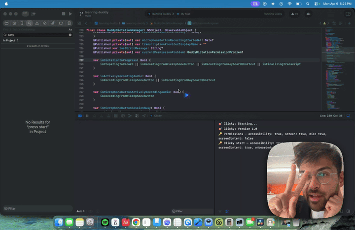

# Pace

<p align="center">
  
</p>

**Voice agent for Mac. Answers in under 500ms. Zero API cost. Fully on-device.**



<sub>Meet the mascot — the notch, alive. Brand assets in [`docs/brand/`](docs/brand/).</sub>

A menu-bar voice agent for macOS. Hold a hotkey, talk, and Pace answers — reading the screen you're looking at and (optionally) clicking on your behalf. Every byte stays on your Mac.

**[Download for Mac — free](https://github.com/sarthakagrawal927/pace/releases/latest)** · macOS 14.2+, Apple Silicon, no account, no email.

- **Every byte stays on your Mac.** No cloud LLM, no API keys, no Cloudflare Worker. Speech, vision, reasoning, and speech-out all run locally. The "airplane mode" badge is the moat — Wispr Flow, Claude Computer Use, and Superhuman literally cannot ship this.
- **Time-to-first-spoken-word in milliseconds, not seconds.** Streaming sentence-by-sentence TTS, pre-warmed VLM + OCR during your speech window, prompt-cache reuse across turns, and per-screen hash caching collapse the perceived latency. The number is logged per turn (`⚡ TTFSW: …ms`) and aggregated by [`scripts/benchmark_ttfsw.sh`](./scripts/benchmark_ttfsw.sh) — own the metric, don't just claim the speed.
- **Agent mode that acts.** With `EnableActions=true` Pace can click, type, scroll, and press keys — synthesised via AX-tree-first targeting that falls back to CGEvent. The app can ask for approval before executing tools. Plan-act-observe loop re-screenshots between actions; the planner emits `[DONE]` when finished. Capped at 8 steps by default.
- **Quiet by default.** Action mode off; permissions gated; the local VLM only fires when the transcript references the screen.

## Build from source

```bash
# 1. Provision LM Studio + the two models (idempotent).
./scripts/setup-local.sh

# 2. Open the project and Cmd+R.
open leanring-buddy.xcodeproj
```

Full setup details, switches, and tuning guidance: see [`SETUP_LOCAL.md`](./SETUP_LOCAL.md).

Architecture and per-file responsibilities: see [`AGENTS.md`](./AGENTS.md).

## What it runs on

- **Speech-to-text**: Apple `SFSpeechRecognizer` (on-device, instant).
- **Screen understanding**: a small vision-language model via LM Studio (default: UI-Venus-1.5-2B, the GUI-specialist 2B model) merged with native Apple Vision OCR for text fidelity.
- **Reasoning / planning**: any OpenAI-compatible reasoner via LM Studio (default: Qwen3-30B-A3B, MoE — 3B active params, scored 15/15 on Pace's eval at ~925ms mean). `cache_prompt: true` sent on every request.
- **Text-to-speech**: `AVSpeechSynthesizer`, sentence-streamed so audio starts within ~500ms of the planner's first token.
- **Click / keystroke synthesis**: `AXUIElement` (semantic press) then `CGEvent` fallback.
- **Voice input UI**: Whisper Flow-style glassmorphic pill.
- **Cursor**: Codex-style arrow with linear gradient + highlight stroke.
- **Walking avatar**: small SwiftUI character at the bottom of the cursor screen; click to open the menu-bar panel.

## Requirements

- macOS 14.2+ (ScreenCaptureKit)
- Xcode 16+ (for SwiftPM synchronized folder groups)
- Apple Silicon recommended (MLX acceleration in LM Studio)
- ~20-28 GB free RAM with both LM Studio models loaded (default 2B VLM + 30B MoE planner)
- Homebrew (for LM Studio install via the setup script)

## Benchmark your own latency

```bash
# Use Pace normally for a few minutes, then:
./scripts/benchmark_ttfsw.sh --last 10m
```

Outputs a markdown table with n, min, p50, p95, max, mean for TTFSW (time-to-first-spoken-word) and TTFT (planner time-to-first-token). The number you publish is the number you measure on your own machine — paste straight into PRs, blog posts, or the landing page.

## Test coverage

Pace targets an **EXEMPLARY** testing tier: **> 80%** line coverage on core logic (parser, executor, memory, planner clients) and **> 70%** on UI. The suite is 818 tests across 103 files, and coverage is collected on every CI run.

<!-- coverage badge placeholder — swap in a live badge once coverage gating is wired to a reporting backend -->


Run coverage locally:

```bash
./scripts/test-pace.sh --coverage
```

Per-component targets, local extraction details, and how CI enforces coverage: see [`docs/test-coverage.md`](./docs/test-coverage.md).

## License

MIT — see [`LICENSE`](./LICENSE).

---

*Wispr Flow needs a server. Claude Computer Use needs the cloud. Pace needs neither — and it answers in under 500ms.*
